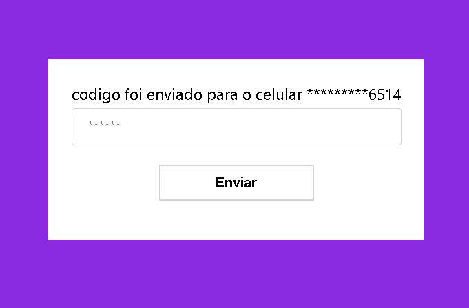

#react com 2fa usando o twilio

App feito com react, styled compomnent, typescript e um pouco de redux e uma adaptação do formik no hooks para o formulario, o foco não era o css mas o seu funcionamento 
como o envio de sms 

Você faz o registro com o numero do celular, e quando for fazer o login ele envia um sms para autenticar

Tem dois redux, um com as informações do usuário (que acabou não sendo utilizado) e o do sms, com digito e mensagem 

Se tudo ocorrer bem você deve ser redirecionado para pagina home "/", você só consegue acessar ela atraves do redireciononamento setando o auth como true, caso tente acessar sem estar autenticado vai ser redirecionado

App simples, feito para estudo

   
   
   
   

 
